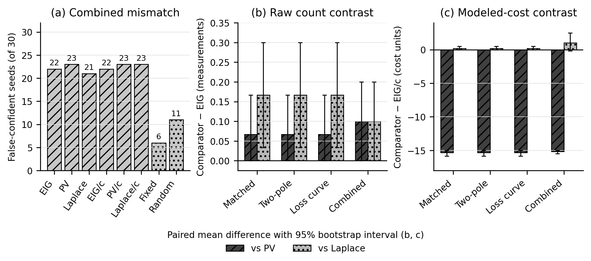

<!-- Source: wiki/Home.md; update with `python wiki/build.py write-readme`. -->

# Bayesian calibration and sequential design for magnetic-core models

This repository studies sequential measurement selection for joint Bayesian
calibration of Steinmetz core-loss and Cole--Cole complex-permeability models.
It contains posterior inference, expected information gain (EIG), paired
acquisition-policy benchmarks, estimator qualification, measured-data model
checks, and frozen evidence for the magnetic-component case study.

Authors: Viet Hoang Duong, Viet Huy Duong, and Lun-Min Shih.

## Why this study

Magnetic-core characterization couples several responses—core-loss density,
complex permeability and magnetizing inductance—over frequency, flux density
and temperature. Dense measurement sweeps are expensive, while a posterior
that is narrow inside an inadequate forward model can still be physically
wrong. This project asks when Bayesian sequential design genuinely reduces
the measurements needed for a stated prediction target, and when apparent
precision is instead caused by the model or stopping rule.

The present implementation uses an isothermal Steinmetz core-loss law and a
one-pole Cole--Cole permeability law. These low-order models make the
six-parameter inference and acquisition problem explicit, but their adequacy
must be tested separately from posterior computation.

## Research questions

1. Can the six-coordinate posterior be recovered without centering the prior
   or sampler on the hidden generating value?
2. Does EIG reach a declared local predictive-precision gate sooner than
   fixed, randomized, predictive-variance and Laplace D-optimal policies?
3. Does dividing utility by modeled acquisition cost improve cost to gate?
4. Does a narrow local posterior interval remain truth-accurate when the data
   generator departs from the inference model?
5. Which conclusions survive measured-data adequacy checks?

## Contributions

- A joint Bayesian calibration pipeline for three Steinmetz and three
  Cole--Cole coordinates, with transformed priors and state-level convergence
  checks. [E1](wiki/evidence/Evidence-Sources.md#e1)
- A paired 30-seed benchmark in which every policy receives the same
  candidate-indexed outcomes and the candidate library contains 37 unique
  isothermal designs. [E1](wiki/evidence/Evidence-Sources.md#e1)
- An eight-policy comparison separating raw information gain from modeled-
  cost objectives and including randomized, predictive-variance and Laplace
  D-optimal comparators. [E4](wiki/evidence/Evidence-Sources.md#e4)
- A preregistered 120-task model-mismatch campaign that distinguishes local
  posterior precision from truth accuracy and latent-holdout performance.
  [E16](wiki/evidence/Evidence-Sources.md#e16)
- A public evidence chain from registered configurations and sanitized task
  records to reconstructed aggregates, claim language and document releases.
  [E8](wiki/evidence/Evidence-Sources.md#e8), [E16](wiki/evidence/Evidence-Sources.md#e16)

## Study design at a glance

| Layer | Purpose | Evaluation |
|---|---|---|
| Identifiability and recovery | Check the six-coordinate inference implementation | Fisher spectrum and five prior-predictive matched-model seeds |
| Sequential acquisition | Compare where each policy measures next | 30 paired seeds, eight policies, shared candidate outcomes |
| Model mismatch | Test whether local precision remains truth-accurate | Matched control plus three locked structural departures |
| Measured-data adequacy | Test the low-order laws against public material records | Channel-specific in-sample residuals and convergence gates |
| Evidence audit | Prevent claims from outrunning their source records | Hash-bound aggregates, raw-record bundles and Wiki checks |


## Main findings

The validated 30-paired-seed matched-model benchmark does not show a material
EIG advantage over the two strong acquisition comparators. The subsequently
preregistered MM-3 campaign shows that reaching the local precision gate does
not protect against false confidence under the three locked structural
departures. [Model-mismatch evidence E16](wiki/evidence/Evidence-Sources.md#e16)

| Comparison | Paired result | Defensible interpretation | Evidence |
|---|---|---|---|
| Raw EIG vs predictive variance | Both stop at 5 measurements in all 30 pairs | Tie on measurement count | [E4](wiki/evidence/Evidence-Sources.md#e4) |
| Raw EIG vs Laplace D-optimality | Both stop at 5 measurements in all 30 pairs | Tie on measurement count | [E4](wiki/evidence/Evidence-Sources.md#e4) |
| EIG/cost vs predictive variance/cost | Predictive variance uses 15.17 fewer modeled-cost units on average and wins all 30 pairs | EIG/cost loses on cost to gate | [E4](wiki/evidence/Evidence-Sources.md#e4) |
| EIG/cost vs Laplace D-optimality/cost | Equal modeled cost in all 30 pairs | Tie on modeled cost | [E4](wiki/evidence/Evidence-Sources.md#e4) |
| Raw EIG vs fixed channel-balanced traversal | 5 versus 9 measurements in all 30 pairs | Improvement over this specified traversal only | [E4](wiki/evidence/Evidence-Sources.md#e4) |

The recorded paths are consistent with objective--gate misalignment. The three
raw utilities rank the 37-candidate library similarly and finish the
complementary core-loss and permeability measurements at the same discrete
stopping step. Under cost normalization, EIG usually selects an inexpensive
inductance point before the core-loss point that controls the stopping gate;
predictive variance selects the gate-relevant core-loss point first. This is a
post hoc descriptive result for the present benchmark, not a general ordering
of acquisition methods. [Trajectory evidence E5](wiki/evidence/Evidence-Sources.md#e5)
and [selection-path evidence E9](wiki/evidence/Evidence-Sources.md#e9)

In MM-3 combined mismatch, raw EIG reached the gate in 30/30 seeds but was
false-confident in 22/30. Core-loss latent-holdout RRMSE was 19.68% with 15.69%
90% interval inclusion; at 100°C the corresponding values were 30.55% and 0%.
Raw EIG's mean count advantage over the two strong comparators was only 0.10
measurements, while EIG/cost lost to predictive-variance/cost in all 30 pairs.
These results concern the locked synthetic departures, not measured magnetic
materials. [E16](wiki/evidence/Evidence-Sources.md#e16)



## What the evidence means

The current evidence supports:

- matched-model synthetic recovery as an implementation check [E2](wiki/evidence/Evidence-Sources.md#e2);
- paired policy outcomes under the finite candidate library and local
  two-target precision gate [E4](wiki/evidence/Evidence-Sources.md#e4);
- modeled acquisition cost under the declared cost table [E4](wiki/evidence/Evidence-Sources.md#e4);
- in-sample adequacy diagnostics for accepted measured-data fits [E7](wiki/evidence/Evidence-Sources.md#e7).
- truth-error, latent-holdout and paired-policy outcomes for the three locked
  synthetic mismatch families [E16](wiki/evidence/Evidence-Sources.md#e16).

It does not establish laboratory-time savings, global six-parameter
identification, calibrated physical uncertainty, robust performance under
structural model mismatch, stable measured-data EIG rankings, or a validated
optimal laboratory plan. These boundaries are maintained in the
[claim registry](wiki/claims/Claims-and-Limits.md).

Accepted measured-data fits retain substantial loss-component discrepancy:

| Response | Accepted-fit RRMSE | Evidence |
|---|---:|---|
| Core-loss density | 8.79%--18.21% | [E7](wiki/evidence/Evidence-Sources.md#e7) |
| Storage permeability, \(\mu'\) | 6.89%--9.33% | [E7](wiki/evidence/Evidence-Sources.md#e7) |
| Loss permeability, \(\mu''\) | 36.77%--52.42% | [E7](wiki/evidence/Evidence-Sources.md#e7) |

The one-pole model does not reproduce the retained \(\mu''\) records adequately,
so measured-data acquisition suggestions remain model-conditional.
[E7](wiki/evidence/Evidence-Sources.md#e7)

## Project status

The present research phase is closed for the journal snapshot. The
[handoff and future-work register](wiki/status/Research-Handoff.md) records the
unresolved questions, evidence boundaries, and requirements for a successor
study; closure does not imply laboratory validation or calibrated uncertainty.

| Work product | State | Evidence or protocol |
|---|---|---|
| 30-seed, eight-policy matched-model benchmark | Validated | [E1](wiki/evidence/Evidence-Sources.md#e1), [E4](wiki/evidence/Evidence-Sources.md#e4) |
| Nested-EIG estimator setting | Qualified for the declared benchmark | [E3](wiki/evidence/Evidence-Sources.md#e3) |
| Public raw-to-aggregate audit bundle v2 | Published and independently verifiable | [E8](wiki/evidence/Evidence-Sources.md#e8) |
| Comparator selection-path analysis | Post hoc diagnostic complete | [E9](wiki/evidence/Evidence-Sources.md#e9) |
| Model-mismatch campaign MM-1 | Closed with 119/120 valid task records; not admitted | [E10](wiki/evidence/Evidence-Sources.md#e10), [MM-1 record](wiki/experiments/Model-Mismatch-Preregistration.md) |
| Model-mismatch campaign MM-2 | Closed with 119/120 valid task records and one prospectively retained sampler rejection; not admitted | [E11](wiki/evidence/Evidence-Sources.md#e11), [MM-2 record](wiki/experiments/Model-Mismatch-V2-Preregistration.md) |
| Sparse-posterior mixing diagnostic | Complete 18-task matrix: the three-measurement state passes the locked mixing criteria; the four-measurement state remains unresolved | [E12](wiki/evidence/Evidence-Sources.md#e12), [SparseMix-1 record](wiki/experiments/Sparse-Posterior-Mixing-Preregistration.md) |
| Alternative-sampler pilot | Complete 24-task full-chain audit; DE + snooker selected for subsequent confirmation | [E13](wiki/evidence/Evidence-Sources.md#e13), [Sampler comparison](wiki/experiments/Sparse-Sampler-Pilot.md) |
| SparseMix-2 | Complete 16-task, 48-artifact audit; both locked states pass with DE + snooker | [E14](wiki/evidence/Evidence-Sources.md#e14), [Protocol and result](wiki/experiments/Sparse-Mixing-V2-Preregistration.md) |
| Production sampler integration | Both locked states pass the adaptive implementation check | [E15](wiki/evidence/Evidence-Sources.md#e15) |
| Model-mismatch campaign MM-3 | Complete and admitted under its numerical contract: 120/120 validated records; local gate failure under mismatch quantified | [E16](wiki/evidence/Evidence-Sources.md#e16), [protocol and result](wiki/experiments/Model-Mismatch-V3-Preregistration.md#result) |
| Gate-aligned utility and simulation-based calibration | Proposed successor studies; neither has been preregistered or run | [Decision 0001](wiki/decisions/0001-gate-aligned-objective.md) |

The admitted evidence is bound to release
`20260817T072230Z_401e3030fe13`, manifest SHA-256
`85448a2c3c9db2db051c94543d8a336e7157d55289f10c1792e9c57d433812f7`.
[Release evidence E8](wiki/evidence/Evidence-Sources.md#e8)

MM-3 is bound separately to aggregate SHA-256
`03e8d81c48f3b5eb2c807a47b880972d3ea727b149788c2deffc35f1ac1d222d`
and its 120-record public audit asset. [Model-mismatch evidence E16](wiki/evidence/Evidence-Sources.md#e16)

## Research record and document releases

The Wiki is the current research source. The repository README is rendered
from this page and summarizes the same research state. An evidence release is
a frozen computation record; a document release is an immutable conference or
journal PDF produced from one reviewed Wiki revision when a submission is
needed. Routine Wiki updates do not rewrite archived PDFs. See the
[paper export contract](wiki/manuscript/Paper-Export-Contract.md).

## Models and measured-data scope

| Response | Forward model | Active parameters | Measured-data scope |
|---|---|---|---|
| Core-loss density | Isothermal Steinmetz law | `k`, `alpha`, `beta` | N49, N87, N95, and 3C95 temperature cohorts |
| Complex permeability | One-pole Cole--Cole law | `mu_s`, `f_rel`, `alpha_cc` | Accepted N87 and N95 LEA-MTB records |

Raw measured curves are not redistributed. Upstream file identities and
checksums are declared in the repository data manifest. The published evidence
projection contains only disclosure-safe aggregate and audit records.

## Read the research

| Need | Canonical page |
|---|---|
| Guided entry and complete directory | [Wiki index](wiki/overview/Index.md) |
| Current lifecycle state | [Project status](wiki/status/Project-Status.md) |
| Full methods and scientific argument | [Full manuscript](wiki/manuscript/Full-Manuscript.md) |
| Supported and unsupported claim language | [Claims and limits](wiki/claims/Claims-and-Limits.md) |
| Completed computations and comparator analysis | [Scientific job results](wiki/results/Scientific-Job-Results.md) |
| Numerical source map and hashes | [Evidence sources](wiki/evidence/Evidence-Sources.md) |
| Raw-to-aggregate verification | [Reproduce and audit](wiki/operations/Reproduce-and-Audit.md) |
| Conference and journal release rules | [Authoring and snapshots](wiki/manuscript/Authoring-and-Snapshots.md) |

## Verify the repository

Python 3.11 or newer is required for the validation environment.

```bash
python -m venv .venv
source .venv/bin/activate
python -m pip install -e '.[test]'
pytest
python wiki/build.py check
```

The validation suite checks implementation contracts, evidence bindings,
public-disclosure rules, navigation, README projection, and document-release
capability. Full MCMC and EIG campaigns use the pinned compute workflow.

## Repository map

| Path | Contents |
|---|---|
| [`wiki/`](https://github.com/hoangduong6210/EIG-bayesian-for-Recover-potential-Physical-Parameter-of-MagComponent/tree/main/wiki) | Canonical research narrative, claims, evidence map, and manuscript source |
| [`src/magcore_calib/`](https://github.com/hoangduong6210/EIG-bayesian-for-Recover-potential-Physical-Parameter-of-MagComponent/tree/main/src/magcore_calib) | Forward models, priors, inference, EIG, and diagnostics |
| [`experiments/`](https://github.com/hoangduong6210/EIG-bayesian-for-Recover-potential-Physical-Parameter-of-MagComponent/tree/main/experiments) | Scientific experiment entry points |
| [`configs/`](https://github.com/hoangduong6210/EIG-bayesian-for-Recover-potential-Physical-Parameter-of-MagComponent/tree/main/configs) | Models, samplers, acquisition policies, and seed contracts |
| [`results/`](https://github.com/hoangduong6210/EIG-bayesian-for-Recover-potential-Physical-Parameter-of-MagComponent/tree/main/results) | Published evidence projections and frozen releases |
| [`paper/`](https://github.com/hoangduong6210/EIG-bayesian-for-Recover-potential-Physical-Parameter-of-MagComponent/tree/main/paper) | Immutable conference and journal document releases |

Citation metadata are provided in `CITATION.cff`. Software is released under
the MIT License; upstream datasets retain their original licenses and
attribution requirements.
