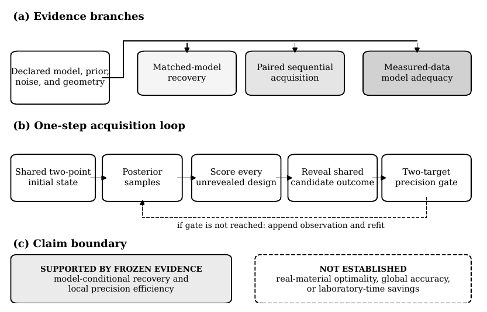
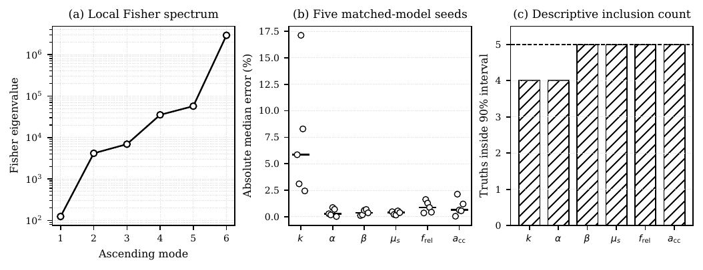
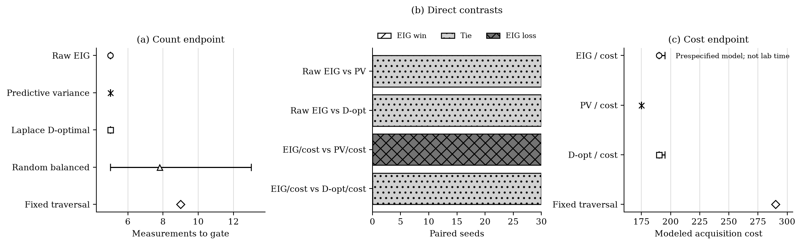
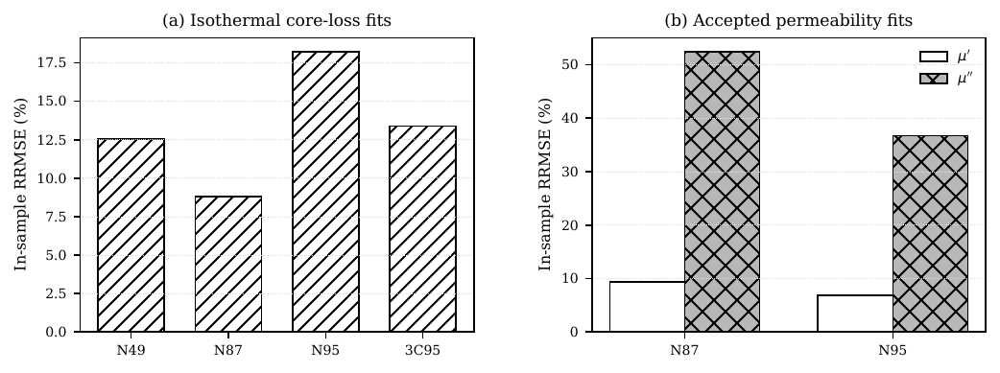

# Expected-Information-Gain-Guided Bayesian Calibration of Magnetic-Core Loss and Permeability Models for Power Converters

Viet Hoang Duong¹, Viet Huy Duong², and Lun-Min Shih¹  
¹ Department of Computer Science, Da-Yeh University, Taiwan  
² Department of Computer Science, Kent State University, United States of America

> **Living manuscript.** This page is the current scientific narrative. The
> PDFs under `paper/` are versioned snapshots and can lag this page until an
> explicit snapshot is approved.

## Abstract

Magnetic-core models used in power-converter design are commonly fitted to
nominal material curves despite limited operating-point coverage and material
variation. We present a Bayesian framework that calibrates Steinmetz core-loss
and Cole--Cole complex-permeability models and evaluates expected information
gain (EIG) for sequential measurement selection. Five prior-predictive,
matched-model recovery cases gave per-parameter median absolute relative
errors from 0.27% to 5.85%, with the generating values inside 28 of 30
equal-tailed 90% model-conditional credible intervals. In a separate
30-paired-seed benchmark with shared candidate outcomes, raw EIG reached a
prespecified two-target latent-response precision gate in five measurements,
compared with nine for a deterministic fixed channel-balanced traversal.
Against stronger comparators, however, raw EIG tied predictive variance and
Laplace D-optimality on measurement count in all 30 pairs. EIG per modeled
cost tied Laplace D-optimality but required a mean 15.17 more modeled seconds
than predictive variance (95% paired-bootstrap interval 15.00--15.50 seconds
in favor of predictive variance). No policy failed the gate. On accepted
public measured records, in-sample RRMSE was 8.79%--18.21% for core loss,
6.89%--9.33% for $\mu'$, and 36.77%--52.42% for $\mu''$; the loss-component
residuals expose substantial one-pole model discrepancy. The evidence supports
a reproducible, model-conditional acquisition benchmark. It does not show EIG
superiority over strong comparators, measured laboratory-time savings, global
six-parameter identification, or a validated optimal laboratory plan.

*Keywords:* Bayesian calibration; magnetic core; core loss; complex
permeability; sequential experimental design; expected information gain.

# Introduction

Power-converter efficiency, thermal margin, and magnetic-component
sizing depend on models for volumetric core loss and complex
permeability. Vendor curves provide essential design information, but
cover a finite set of frequencies, flux densities, and temperatures and
normally do not provide a joint parameter distribution. Fitting one
nominal curve can therefore hide parameter non-identifiability and model
discrepancy.

Bayesian calibration represents uncertainty in model parameters
conditional on the selected model, observations, and prior. Bayesian
experimental design ranks a candidate measurement by its expected
reduction of posterior uncertainty [@chaloner1995; @ryan2016]. Here this
framework is implemented as greedy one-step EIG over a finite library,
not a globally optimal sequential policy. This is useful when
characterization time is limited and dense uniform sweeps are costly. It
also makes the measurement objective explicit: the selected point should
reduce uncertainty in the quantities represented by the model, not
merely occupy an unmeasured location in a frequency--flux grid.

This work contributes (1) a reproducible posterior formulation for
Steinmetz and Cole--Cole parameters, (2) a Fisher-spectrum diagnosis of
locally constrained parameter combinations, and (3) an eight-policy paired
benchmark covering EIG, fixed and randomized channel-balanced traversal,
predictive variance, and Laplace D-optimality under raw and modeled-cost
objectives. The evidence also exposes estimator convergence, adaptive MCMC
diagnostics at every acquisition state, paired candidate outcomes, disjoint
holdout prediction, six-parameter recovery, measured-data acceptance gates,
and the raw-to-aggregate evidence chain. These elements answer distinct
questions and cannot be substituted for one another.

The remainder of the paper reviews magnetic and Bayesian design
literature, defines the forward and statistical models, documents the
reproducible protocol, and then reports synthetic and measured-data
results from one prespecified evaluation.

# Research Questions and Evidence Scope

The study is organized around five research questions. *RQ1* asks
whether the implemented six-coordinate inference problem is locally
sensitive in all active directions and whether the posterior computation
can recover known matched-model parameters. *RQ2* asks whether greedy
raw EIG reaches one declared local precision gate with fewer
measurements than predictive variance and Laplace D-optimality when every
policy sees identical candidate outcomes. *RQ3* asks the corresponding
question for EIG per prespecified modeled cost. *RQ4* asks whether the final
posterior predicts a disjoint 23-point latent holdout and recovers all six
generating parameters. *RQ5* asks how well the low-order forward laws describe
accepted public measured records in sample.

The evidence ladder shown above prevents answers from being combined
beyond their design. Local Fisher rank is not global identifiability;
matched-model recovery is not validation on real ferrites; posterior
precision is not truth proximity; and in-sample measured residuals are
not held-out predictive accuracy. The acquisition result is therefore an
algorithmic, model-conditional comparison under a finite library and a
local gate. This explicit estimand is narrower than "optimal
magnetic-component identification," but it is reproducible and
falsifiable.

The current frozen evidence contains eight policies: raw EIG, EIG divided by
modeled cost, deterministic and randomized channel-balanced traversal,
predictive variance under raw and per-cost objectives, and Laplace
D-optimality under raw and per-cost objectives. The four direct strong-
comparator contrasts were declared before the confirmatory seed results were
aggregated. The fixed and randomized traversals remain useful contextual
baselines, but they are not evidence that EIG dominates modern acquisition
heuristics.

# Related Work

## Magnetic loss and permeability models

The Steinmetz power law remains a compact engineering description for
sinusoidal loss, while loss-separation and hysteresis models provide
more physical
decompositions [@steinmetz1892; @bertotti1988; @jiles1986]. Converter
waveforms motivated modified and generalized Steinmetz relations that
integrate the instantaneous flux-density trajectory or use waveform
correction factors [@reinert2001; @li2001; @venkatachalam2002].
Measurement-led and loss-separation approaches further show why
coefficients fitted under one waveform or operating window need not
transfer unchanged to another  [@vandenbossche2004; @roshen2007].
Subsequent work improved practical loss calculation and reviewed the
physical contributions to loss in soft
ferrites [@muehlethaler2012; @dobak2022]. Textbook treatments emphasize
that material law, geometry, winding, and thermal assumptions must
remain distinct in component design  [@snelling1988; @mclyman2011].

Frequency-dispersive permeability is commonly described through
relaxation or resonance spectra. The Cole--Cole law introduced a
broadened relaxation distribution [@cole1941]; applying its algebraic
form to permeability is an engineering adaptation rather than a claim
that ferrite magnetization is a dielectric process. Classical ferrite
dispersion theory and measurements of Mn--Zn and Ni--Zn ferrites show
that domain-wall motion, rotational processes, resonance, and relaxation
can all shape $\mu'$ and $\mu''$ [@snoek1948; @tsutaoka2003]. The
single-pole model used here is therefore intentionally diagnostic: a
large loss-component residual is evidence for missing dynamics, not a
parameter-estimation failure alone.

Open magnetic datasets now permit reproducible comparisons beyond
individual vendor plots. MagNet provides systematically measured
core-loss data across materials and excitations [@magnet2022], while the
LEA material database publishes machine-readable permeability and loss
records with source metadata [@materialdatabase]. Public data improve
traceability but do not substitute for a controlled multi-lot
characterization campaign.

## Bayesian calibration and experimental design

Bayesian calibration represents parameter uncertainty conditional on a
forward model, likelihood, and prior [@gelman2013]. Computer-experiment
literature distinguishes emulator uncertainty, observation error,
calibration parameters, and structural
discrepancy [@sacks1989; @kennedy2001]. Validation frameworks
consequently compare predictions with observations rather than treating
posterior concentration as proof of physical validity  [@bayarri2007].
Ignoring discrepancy can bias inferred physical parameters and produce
overconfident extrapolation [@brynjarsdottir2014]. Calibration theory
for imperfect simulators also demonstrates that the physical parameter
and discrepancy can be confounded unless additional structure is
imposed [@tuo2015; @plumlee2017]. We do not introduce an unidentified
discrepancy process into the present six-parameter fit; instead,
measured residuals are reported as a separate adequacy diagnostic.

Bayesian experimental design formalizes the value of a proposed
observation through expected utility. Lindley's information criterion
 [@lindley1956], foundational reviews [@chaloner1995; @ryan2016], and
classical optimum-design methods [@atkinson2007] motivate the EIG
criterion used here. Estimation remains challenging because the
predictive density is generally unavailable; relevant strategies include
Laplace and MCMC approximations [@ryan2003], nested Monte Carlo
 [@rainforth2018], multilevel estimators [@goda2020], stochastic
simulation-based optimization  [@huan2013], and variational
bounds [@foster2019]. Adaptive-policy amortization offers a scalable
direction for longer experimental sequences  [@foster2021], but the
present work deliberately uses a transparent one-step ranking over a
finite candidate library.

Information-based acquisition connects Shannon entropy and
Kullback--Leibler divergence to active data selection
 [@shannon1948; @kullback1951; @mackay1992]. Classical D-optimal design
instead optimizes a determinant of an information matrix and is linked
to equivalence theorems [@kiefer1960; @atkinson2007]. These criteria
coincide only under particular approximations; the fixed traversal used
in the reported benchmark is neither of them.

# Magnetic-Core Models

## Core loss

For sinusoidal excitation within a specified operating window, the
Steinmetz model is
$$P_v(f,B_{\mathrm{pk}})=k f^{\alpha}B_{\mathrm{pk}}^{\beta},
  \label{eq:steinmetz}$$ where $P_v$ is volumetric loss and
$(k,\alpha,\beta)$ are inferred parameters  [@steinmetz1892]. The units
of $k$ depend on the units used for $P_v$, $f$, and $B_{\mathrm{pk}}$.
The implemented Steinmetz equation is not temperature dependent in the present
implementation. Measured-data analysis therefore uses a specified
temperature subset; extrapolation across temperature is out of scope.
More general waveform-dependent loss equations remain important for
converter application studies [@reinert2001; @muehlethaler2012].

## Complex permeability

We adopt the $e^{j2\pi ft}$ time convention and write
$\mu_r=\mu'-j\mu''$, so the reported loss component is
$\mu''=-\operatorname{Im}\mu_r\geq0$ for a passive response. The
relative complex permeability is represented with a single Cole--Cole
relaxation [@cole1941], $$\mu_r(f)=1+\frac{\mu_s-1}
 {1+\left(jf/f_{\mathrm{rel}}\right)^{1-a_{\mathrm{cc}}}},
 \label{eq:colecole}$$ where $\mu_s$ is low-frequency permeability,
$f_{\mathrm{rel}}$ is a relaxation frequency, and $a_{\mathrm{cc}}$
broadens the relaxation. Storage and loss components are evaluated
separately because a model can fit $\mu'$ while failing to represent
$\mu''$. A one-pole model is a deliberate low-order approximation, not a
complete ferrite loss model.

The implemented Cole--Cole equation fixes the high-frequency asymptote to unity and
absorbs the angular-frequency convention into $f_{\mathrm{rel}}$. The
real and loss components follow from the same complex denominator, which
prevents independent tuning of $\mu'$ and $\mu''$. For an optional
inductance channel, the real component is mapped through
$L_m=\mu_0\mu' N^2A_e/\ell_e$ using specified geometry
 [@snelling1988; @mclyman2011]. Geometry is never inferred jointly with
material parameters in the present study.

## Validity window

Both forward laws are isothermal and evaluated only inside specified
data ranges. A data point is defined by channel, frequency, peak flux
density, and temperature. Core-loss points require positive
$B_{\mathrm{pk}}$; permeability points use small-signal records. The
likelihood rejects mixed temperature cohorts. Measured permeability uses
material-specific cohorts of $25\pm0.75\,^{\circ}\mathrm C$ for N87 and
$30\pm0.75\,^{\circ}\mathrm C$ for N95. Measured core loss uses
$25\pm0.5\,^{\circ}\mathrm C$ for N49, N87, and N95, and
$100\pm0.5\,^{\circ}\mathrm C$ for 3C95. These restrictions prevent an
apparently precise posterior from silently extrapolating across
temperature, waveform, or excitation regime.

::: table*
  Physical parameter   Active coordinate         Role                         Principal response   Main limitation
  -------------------- ------------------------- ---------------------------- -------------------- --------------------------------------
  $k$                  $\log k$                  core-loss scale              $P_v$                units follow the declared convention
  $\alpha$             $\alpha$                  frequency exponent           $P_v$                local to sinusoidal, isothermal data
  $\beta$              $\beta$                   flux-density exponent        $P_v$                no waveform or DC-bias dependence
  $\mu_s$              $\log\mu_s$               low-frequency permeability   $\mu',L_m$           fixed rather than inferred geometry
  $f_{\mathrm{rel}}$   $\log f_{\mathrm{rel}}$   relaxation frequency         $\mu',\mu''$         one effective relaxation only
  $a_{\mathrm{cc}}$    $a_{\mathrm{cc}}$         relaxation broadening        $\mu',\mu''$         no multiple resonances
:::

# Bayesian Calibration and Design

Let $\theta=(\log k,\alpha,\beta,\log\mu_s,\log f_{\mathrm{rel}},
a_{\mathrm{cc}})$ denote the active transformed parameters. Log
coordinates enforce positivity of scale parameters while retaining
direct coordinates for the exponents. For observation $y_o$ at design
$d_o$, the likelihood is $$p(\mathbf y\mid\theta,\mathbf d)=
 \prod_o \mathcal N\!\left(y_o;F_o(\theta,d_o),\sigma_o^2\right),$$ with
fixed relative scales. Synthetic scales are 3% for core loss, 2% for $\mu'$,
5% for $\mu''$, and 1% for inductance; measured records use a 3% relative
scale as a weighting model. The posterior is
$$p(\theta\mid\mathbf y,\mathbf d)\propto
 p(\mathbf y\mid\theta,\mathbf d)p(\theta).$$ Priors are defined
directly in the transformed space used by the sampler, so no
inverse-transform Jacobian is added to this active-coordinate density.
Bounds encode physically admissible numerical domains, not empirical
proof that the chosen model is correct.

The six coordinates divide into two response blocks in the likelihood
but are sampled jointly. Core-loss observations directly update
$(\log k,\alpha,\beta)$, while permeability and inductance observations
update $(\log\mu_s,\log f_{\mathrm{rel}},a_{\mathrm{cc}})$. Joint
sampling retains a single posterior contract and permits one acquisition
library to contain all channels; it does not create physical coupling
absent from the forward laws.
The parameter table makes this structural separation explicit.

Four uncertainty sources must be distinguished. *Parameter uncertainty*
is represented by posterior draws conditional on the chosen model and
fixed geometry. *Observation uncertainty* enters through the declared
Gaussian scale. *Monte Carlo uncertainty* arises because posterior and
EIG integrals are approximated by finite samples. *Structural
uncertainty* is exposed by measured residuals but is not parameterized
in the likelihood. Only the first three are quantified in parts of the
present workflow; an EIG score interval is therefore not a total
physical-uncertainty interval.

## Posterior computation and diagnostics

Posterior sampling uses the affine-invariant ensemble construction
 [@goodman2010] implemented by `emcee` [@foreman2013]. Recovery and
measured-data fits retain 5000 steps after 1000 warm-up steps for each of 48
walkers. Acquisition states use a stricter adaptive contract: 4000 warm-up
steps, at least 20,000 retained steps, checks every 10,000 additional steps,
and a hard ceiling of 80,000 retained steps. The same state-keyed chain is
extended rather than restarted. Initial states are perturbations of the fixed
prior center, never the hidden generating truth. A state is accepted only with
finite integrated autocorrelation estimates, at least 50 retained steps per
autocorrelation time, effective sample size at least 400, mean acceptance
between 0.20 and 0.60, and finite log probability for every retained sample.
Failure at the hard ceiling invalidates that policy record.

These checks follow the principle of comparing Monte Carlo variation
with between-sequence behavior [@gelman1992] and modern
effective-sample-size practice [@vehtari2021], but interacting ensemble
walkers are not treated as independent chains. Accordingly, the paper
does not report a conventional $\widehat R$ for the ensemble. Diagnostic
failure invalidates a measured fit for quantitative publication rather
than being repaired by discarding an unfavorable seed.

Matched-model recovery also exercises the complete forward--likelihood--
sampler--summary path against known generating values. It is an
implementation check related to posterior-quantile
validation [@cook2006], but five independent fits do not constitute
simulation-based calibration  [@talts2018]. A calibrated rank experiment
would require many more prior-predictive replications and a uniform-rank
diagnostic. Posterior and residual graphics are interpreted as part of a
Bayesian workflow rather than as substitutes for numerical
diagnostics [@gelman1996; @gabry2019].

The local Fisher approximation [@fisher1922] is
$$\mathcal I_{ij}=\sum_o\frac{1}{\sigma_o^2}
 \frac{\partial F_o}{\partial\theta_i}
 \frac{\partial F_o}{\partial\theta_j}.$$ Its spectrum is computed over
the exact active vector and with reported scaling. A large condition
number indicates locally sloppy combinations but does not by itself
establish global non-identifiability [@gutenkunst2007]. Geometric
analyses of sloppy models likewise interpret broad eigenvalue spectra as
anisotropic distinguishability, not as a universal parameter
ranking [@transtrum2015]. The spectrum is therefore reported together
with its dimension and scaling convention.

Let $\mathcal D_t=(\mathbf y_t,\mathbf d_t)$ denote the observations
available before acquisition step $t$. For candidate $d$, the one-step
EIG is the conditional mutual information [@lindley1956; @chaloner1995]
$$\mathrm{EIG}_t(d)=
 \mathbb E_{\substack{\theta\sim p(\theta\mid\mathcal D_t)\\
 y\sim p(y\mid\theta,d)}}
 \left[
 \log p(y\mid\theta,d)-\log p(y\mid d,\mathcal D_t)
 \right],
 \label{eq:eig}$$ where $$p(y\mid d,\mathcal D_t)=
 \int p(y\mid\vartheta,d)
 p(\vartheta\mid\mathcal D_t)\,d\vartheta .$$ For outer draws
$(\theta_i,y_i)$ and inner posterior draws $\vartheta_{ij}$, the
implemented nested estimator is $$\begin{aligned}
 \widehat U(d)=\frac{1}{N}\sum_{i=1}^{N}\bigg[&
 \log p(y_i\mid\theta_i,d)\\[-0.2ex]
 &-\log\!\left\{\frac{1}{M}\sum_{j=1}^{M}
 p(y_i\mid\vartheta_{ij},d)\right\}\bigg].
 \end{aligned}
 \label{eq:nmc}$$ Finite inner budgets introduce bias through the
logarithm and finite outer budgets introduce variance; close candidates
can therefore exchange rank  [@rainforth2018; @goda2020]. The
convergence campaign described below tests ranking and downstream
endpoint stability rather than assuming one budget is sufficient.

The reported estimator draws outer parameter--observation pairs and uses
inner posterior draws to approximate the posterior-predictive
density [@ryan2003; @rainforth2018]. Each score is repeated 40 times; the
mean, standard error, 95% Monte Carlo interval, and top-rank frequency
are retained. Candidate streams are seeded from a stable key comprising
channel, frequency, flux density, and temperature, so list permutation
cannot change a design's draws. We evaluate two distinct objectives: raw
EIG for the measurement-count endpoint and EIG divided by a prespecified
modeled acquisition cost for the total-cost endpoint. These intervals
quantify repeated nested-Monte-Carlo variability conditional on the
retained posterior draws and model; they exclude chain-to-chain,
structural-model, geometry, and noise-model uncertainty.

## Paired sequential policy

After the same two initial observations---$P_v$ at 30 kHz, 0.05 T, and
$25\,^{\circ}\mathrm C$, and $\mu'$ at 10 kHz and
$25\,^{\circ}\mathrm C$---each policy selects one unrevealed candidate,
receives its pre-generated noisy outcome, refits the posterior, and
checks the common precision gate. The registry contains exactly eight
policies. Raw EIG and predictive variance maximize their unscaled criteria;
their per-cost forms divide those criteria by the declared channel cost.
Laplace D-optimality greedily maximizes the log-determinant increment of a
local posterior-precision approximation, with an analogous per-cost form. The
contextual comparators are deterministic fixed and seeded randomized
channel-balanced traversals. The fixed traversal is not called a uniform grid,
and neither traversal is a space-filling or globally optimal design. All
policies share the candidate library, latent
truth, candidate-indexed noisy outcomes, maximum budget, and stopping
rule. The candidate library is isothermal, so it contains no
temperature-only duplicates of the implemented forward laws. The
numerical settings are summarized below.

The stopping statistic is the half-width of the central 90% posterior
interval for the noise-free latent mean response divided by the absolute
posterior median. Observation noise is not added to this gate. The two
fixed targets are
$P_v(100\,\mathrm{kHz},0.1\,\mathrm T,25\,^{\circ}\mathrm C)$ at 8% and
$L_m(100\,\mathrm{kHz},25\,^{\circ}\mathrm C)$ at 5%. This is a local
precision criterion: it checks neither truth proximity, six-parameter
recovery, other channels, held-out performance, nor model adequacy. A
policy that misses either threshold is recorded as a failure at the
maximum budget. Candidate EIG integrates over the joint six-parameter
posterior; only the stopping and evaluation endpoint is restricted to
these two responses.

::: table*
  Channel   Frequencies (kHz)                         $B_{\mathrm{pk}}$ (T)   Points   Relative noise   Modeled cost
  --------- ----------------------------------------- ----------------------- -------- ---------------- --------------
  $P_v$     30, 50, 100, 200, 300, 500                0.05, 0.10, 0.20        18       3%               60
  $\mu'$    10, 30, 100, 300, 500, 1000, 2000, 3000   0                       8        2%               20
  $\mu''$   10, 30, 100, 300, 500, 1000, 2000, 3000   0                       8        5%               20
  $L_m$     10, 100, 1000                             0                       3        1%               15

All 37 candidates are at $25\,^{\circ}\mathrm C$. Modeled costs are
positive prespecified units used only for the EIG/cost endpoint; they
are not measured instrument or laboratory durations. The two initial
observations belong to the same library and count toward the stopping
total.
:::

# Computational Reproducibility

All experiments use fixed software versions, specified model and
inference settings, explicit data selections, and deterministic random
seeds. Results are retained at the individual-seed level and are
accepted for aggregation only when all prespecified validity gates pass.

::: {#tab:protocol}
  Item                    Setting
  ----------------------- --------------------------------------------------
  Ensemble sampler        48 walkers; acquisition chains retain 20,000--80,000 adaptively
  Convergence criteria    ESS $\geq400$; steps/$\tau\geq50$
  Acceptance criterion    $0.20$--$0.60$
  Nested EIG              1200 outer; 400 inner; 40 score replicates
  Sequential budget       at most 25 measurements
  Acquisition endpoints   raw EIG/count; EIG/cost/modeled cost
  Temperature cohorts     material and channel specific, as stated in text
  Precision gate          latent mean response: 8% $P_v$; 5% $L_m$

  : Computational settings used for the reported experiments.
:::

The analysis checks all required seed and material cases before forming
aggregate summaries. Records with nonfinite values, failed convergence,
or boundary-active parameters are excluded according to criteria
specified before evaluation. Numerical statements, tables, and figures
are generated programmatically from the same complete set of accepted
records, avoiding manual transcription or selective replacement of
outcomes.

## Estimator-budget qualification

The nested estimator was qualified before the 30-seed acquisition
campaign. Twelve posterior states were formed from four seeds
(7100--7103) after 2, 4, and 6 observations. At each state, 27 candidate
settings crossed outer budgets $\{100,300,900\}$, inner budgets
$\{50,100,300\}$, and replicate counts $\{5,10,20\}$. Every setting was
compared with a 1200-outer, 400-inner, 40-replicate reference. Two
sentinel states were additionally recomputed at 2400 outer and 800 inner
draws with 40 replicates. Prefix-nested random streams made the
lower-budget samples literal prefixes of the larger calculations,
reducing irrelevant differences between settings.

The acceptance decision combined the stable top candidate, Spearman rank
correlation, score-interval overlap, relative reference regret, and
exact agreement of downstream count and modeled-cost endpoints. Ten
disjoint seeds (7200--7209) supplied that downstream check. The selected
setting was then locked before the confirmatory acquisition seeds
7300--7329 were evaluated. This separation prevents selecting an
estimator budget because it happened to produce the most favorable
headline comparison.

::: table*
  Layer                      Prespecified cases                        Retained public evidence                         Scientific role
  -------------------------- ----------------------------------------- ------------------------------------------------ ------------------------------
  Matched recovery           5 generating seeds                        seed-level parameter summaries                   implementation check
  Estimator states           $4\times3=12$                             state records and flattened posterior samples    budget qualification
  Estimator grid             27 budget combinations across 12 states   108 candidate-score records plus 12 references   ranking stability
  Doubled-budget audit       2 sentinel states                         2 doubled-budget score records                   reference sensitivity
  Downstream validation      10 seeds                                  10 policy endpoint records                       endpoint stability
  Confirmatory acquisition   30 paired seeds                           30 complete policy trajectories                  count and cost endpoints
  Measured adequacy          declared material/source pairs            aggregate metrics and disclosed exclusions       model discrepancy diagnostic
:::

The public audit projection retains the campaign records needed to
reconstruct the acquisition endpoints and estimator decision while
removing machine paths and scheduler metadata. Posterior arrays are
retained flattened over sampling draws; because walker and iteration
indices are not present, they are not described as raw MCMC chains. The
compact frozen summary authenticates the reported measured-fit
aggregates and exclusions, but the audit projection does not
independently reconstruct those fits. Raw upstream measured curves
remain governed by their source repositories and are not redistributed
here.

# Evaluation Protocol

Five fixed seeds are used for matched-model recovery. A disjoint,
prespecified set of seeds is used for the paired acquisition comparison
only after the nested-Monte-Carlo setting passes a separate convergence
study. That study uses prefix-nested common random numbers and a
deterministic paired bootstrap of the replicate-mean selector; it
requires stable candidate and reference winners, rank correlation,
score-interval overlap, low reference regret, and downstream endpoint
agreement. The policies share initial observations, candidate library,
realized candidate outcomes, noise policy, budget, and stopping rule.
Results include per-seed counts, modeled costs, and failures, not only
an aggregate ratio. The stopping rule concerns posterior precision of
two latent mean responses and is not an accuracy or coverage guarantee.

For recovery, observations are generated from the same six-parameter
forward family used in inference. A parameter vector is drawn
independently for each seed from a datasheet prior fixed before that
draw; the prior is never rebuilt from the realized truth. Sampler
walkers are initialized around the fixed prior center, not around the
hidden generating vector. Observation noise is then generated
independently. This is a prior-predictive matched-model design: it
removes oracle centering while retaining favorable equality between the
data-generating and inference model families. The reported error is the
absolute relative difference between posterior median and the generating
value. The interval statistic counts whether that value falls within the
equal-tailed 90% model-conditional posterior credible interval. With
only five seeds, the count is a descriptive implementation check, not a
coverage experiment. The Fisher matrix is evaluated in the exact
transformed coordinate system used by sampling.

For the paired acquisition analysis, a stable design-keyed seed
generates one noisy observation for every candidate before any policy is
run. A policy reveals the already generated value when it selects that
design. Thus policy order cannot change the noise attached to a
candidate, and all policies in a seed share the same latent truth and
candidate outcome map. The 30 paired differences are the unit of
analysis. Descriptive means, medians, standard deviations, win and
failure rates, and percentile intervals are computed from those
differences. The reported confidence interval uses 10,000 deterministic
paired bootstrap resamples. It quantifies between-seed variation in this
matched-model experiment and is not a population-wide material claim.

The measured evaluation uses public complex-permeability curves for
specified N95, N87, and 3C95 source/material pairs and datasheet
core-loss curves for N49, N87, N95, and 3C95 [@materialdatabase].
Input-data versions, temperature cohorts, unit conversions, and range
filters were fixed before inference. Storage/loss permeability errors,
core-loss residuals, boundary activity, and operating-window coverage
are reported separately. Records with failed convergence or active
boundary flags are retained for diagnostic review but excluded from
aggregate numerical claims.

Core-loss adequacy is summarized by in-sample relative root-mean-square
error (RRMSE) within each temperature cohort. Permeability adequacy is
evaluated separately for storage and loss components because combining
them can conceal a poor $\mu''$ fit behind the larger magnitude of
$\mu'$. These metrics assess the selected low-order model on observed
records; they are neither held-out prediction errors nor component-level
thermal validation.

# Results

## Identifiability and synthetic recovery

The synthetic $6\times6$ Fisher matrix was full rank. Its eigenvalues span
$1.24\times10^2$ to $2.91\times10^6$, giving a condition number of
$2.35\times10^4$. This broad spectrum indicates strong local sensitivity
anisotropy in the active transformed coordinates; it does not establish
global identifiability. Across five prior-predictive matched-model data sets,
the per-parameter median absolute relative errors ranged from 0.27% to 5.85%.
The known values fell within 28 of 30 equal-tailed 90% model-conditional
posterior credible intervals. This observed inclusion count is descriptive,
not a coverage estimate.

| Parameter | Mean error | Median error | SD | Truth in 90% CI |
|---|---:|---:|---:|---:|
| $k$ | 7.36% | 5.85% | 5.94% | 4/5 |
| $\alpha$ | 0.40% | 0.27% | 0.36% | 4/5 |
| $\beta$ | 0.38% | 0.36% | 0.25% | 5/5 |
| $\mu_s$ | 0.35% | 0.38% | 0.17% | 5/5 |
| $f_{\mathrm{rel}}$ | 0.91% | 0.87% | 0.55% | 5/5 |
| $a_{\mathrm{cc}}$ | 0.91% | 0.62% | 0.79% | 5/5 |

## Nested-estimator qualification

The conservative reference setting of 1200 outer draws, 400 inner draws,
and 40 score replicates was selected by the prespecified convergence
decision. Against doubled-budget sentinels, minimum top-selector agreement was
0.9983 for raw EIG and 1.0000 for EIG/cost; minimum Spearman correlation was
0.9983 and 0.9992, respectively, minimum score-interval overlap was 0.8710,
and maximum relative regret was zero. Ten downstream validation seeds
reproduced the reference count and modeled-cost endpoints. This qualifies the
numerical setting for the campaign; it does not make each finite EIG score
exact or incorporate structural-model uncertainty.

## Paired synthetic acquisition

Raw EIG reached the two-target precision gate in exactly five measurements,
while the deterministic fixed channel-balanced traversal required nine in all
30 paired seeds. The four-measurement difference had zero sample variation and
a bootstrap 95% interval of 4.00--4.00 measurements. This 44.4% reduction is a
valid comparison with that specified baseline, but the strong-comparator
results materially narrow its interpretation.

| Preregistered direct contrast | Endpoint | Mean difference, comparator $-$ EIG | Bootstrap 95% CI | EIG W/T/L |
|---|---|---:|---:|---:|
| Raw EIG vs predictive variance | measurement count | 0.00 | [0.00, 0.00] | 0/30/0 |
| Raw EIG vs Laplace D-optimality | measurement count | 0.00 | [0.00, 0.00] | 0/30/0 |
| EIG/cost vs predictive variance/cost | modeled cost | -15.17 | [-15.50, -15.00] | 0/0/30 |
| EIG/cost vs Laplace D-optimality/cost | modeled cost | 0.00 | [0.00, 0.00] | 0/30/0 |

All eight policies reached the gate in all 30 seeds. Thus the experiment gives
no evidence that raw EIG outperforms predictive variance or Laplace
D-optimality on measurement count. Under the cost objective, predictive
variance reached the gate at modeled cost 175 in every seed, whereas EIG/cost
used 190 in 29 seeds and 195 once. The cost constants are prespecified model
inputs, not measured laboratory durations.

## Disjoint holdout and six-parameter endpoints

The 23-point latent holdout was excluded from acquisition, policy selection,
and stopping. For raw EIG, mean RRMSE was 3.12% for core loss, 1.32% for
$\mu'$, 3.93% for $\mu''$, and 1.20% for $L_m$; mean 90% latent-interval
coverage was 85.8%, 93.9%, 90.0%, and 92.2%, respectively. EIG/cost gave mean
RRMSE 3.15%, 0.95%, 2.78%, and 0.85%, with coverage 85.0%, 93.3%, 89.4%, and
93.3%. These secondary endpoints do not rescue an acquisition-superiority
claim: predictive-variance and Laplace policies had comparable holdout
performance, while the fixed and randomized traversals were often worse.

Final 90% parameter intervals contained a mean 5.13 of six generating
parameters for both EIG objectives. Across policies, however, mean absolute
error for $k$ remained approximately 25.1%--30.7%. Posterior interval inclusion
must therefore not be described as uniformly precise global six-parameter
recovery.

## Measured-data model adequacy

For LEA Material Database permeability records that satisfied the convergence
criteria, RRMSEs were 9.33%/52.42% for $\mu'/\mu''$ on N87 and 6.89%/36.77%
on N95. The larger $\mu''$ errors expose discrepancy in the one-pole model.
N87 and 3C95 MagNet records failed convergence or boundary gates and
were excluded from numerical claims [@magnet2022]. Measured Steinmetz
fits produced in-sample RRMSEs of 8.79% (N87), 12.55% (N49), 13.40% (3C95),
and 18.21% (N95) within their specified temperature cohorts. These are fit
residuals, not held-out errors.

All numerical results in this section use the same prespecified models,
data filters, random seeds, and evaluation criteria.

# Discussion and Limitations

## Interpretation of the evidence

The framework separates whether available measurements constrain
parameters within a chosen model from whether that model represents
measured material behavior. Fisher information and posterior width
address the former locally or conditionally; reported in-sample
residuals expose, but do not fully quantify, the latter. The disjoint synthetic
holdout now measures latent prediction within the matched family; held-out
validation on independently acquired physical material remains future work.

The synthetic results support implementation-level conclusions. Full
local rank shows that every active coordinate affects the specified
synthetic experiment, while the broad spectrum shows that those effects
occur at very different scales. The recovery table then checks the
nonlinear posterior under matched truth. Neither result implies that the
same coordinates are uniquely physical when the material response lies
outside the six-parameter family. This distinction matters for converter
models because several parameter sets can produce similar loss or
permeability over a narrow operating window yet diverge when frequency,
flux density, or temperature changes.

The paired acquisition result shows that EIG exploited posterior structure
relative to the fixed traversal, but it does not isolate an EIG-specific
advantage: raw predictive variance and Laplace D-optimality reached the same
gate in the same number of measurements. Under the modeled-cost objective,
predictive variance was better than EIG in every seed. The result means only
that these policies narrow two specified latent-response intervals efficiently
inside the matched model. It does not establish accurate recovery of a
physical component, global predictive accuracy, or robustness to model
misspecification.

## Implications for converter modeling

For a converter workflow, the posterior is most useful as a conditional
input to loss, inductance, and sensitivity calculations over the
specified operating region. Posterior draws can be propagated through a
component model instead of substituting one nominal coefficient set,
allowing a designer to determine whether parameter uncertainty
materially affects thermal or magnetic design margins. The Fisher
spectrum can motivate testing whether a new channel or a wider,
physically controlled excitation range would constrain a weak direction
more effectively than densifying the original sweep
 [@chaloner1995; @atkinson2007].

Measured residuals define a separate model-adequacy assessment. The
accepted core-loss fits show the error remaining after estimating
Steinmetz coefficients inside one temperature cohort. The much larger
loss-component permeability residuals show that a single Cole--Cole pole
cannot be treated as a broadband physical description for these records.
A component calculation that is sensitive to $\mu''$ should therefore
retain an explicit discrepancy allowance or adopt a higher-order
permeability law before relying on posterior parameter width.
Conversely, a reasonable $\mu'$ residual does not validate $\mu''$,
because the two components occupy different numerical scales and
correspond to different design consequences.

The common evaluation protocol safeguards this interpretation by
preventing combination of a favorable recovery run, a figure from
another seed set, and a measured fit produced under different filters.
Fixed model settings, data selections, and random seeds also make it
possible to distinguish sampling variation from changes to the
computational experiment.

## Threats to validity

Internal validity is limited by five synthetic recovery seeds and 30 paired
acquisition seeds. Pairing controls differences in candidate outcomes
between policies. A prespecified convergence study compares candidate
ranks and downstream endpoints against a higher-budget reference; finite
nested Monte Carlo variance nevertheless remains. Synthetic recovery is
matched-model, and the observed interval-inclusion count is too small to
establish calibrated coverage.

The policy comparison now includes deterministic and randomized balanced
traversals, predictive variance, and Laplace D-optimality. It does not include
a full nonlinear Fisher-greedy implementation, space-filling designs,
multi-step look-ahead, or learned adaptive policies. More importantly, the
direct results do not establish EIG dominance over the strong comparators.
Observation noise and geometry are fixed, and estimator intervals are not
total physical-uncertainty intervals.

Construct validity is limited by the low-order forward models and
available data. The Steinmetz relation is temperature independent, and
one Cole--Cole pole does not capture all ferrite relaxation, resonance,
or loss processes  [@tsutaoka2003]. Measured errors are in-sample.
Public curves may also contain digitization, instrument, preprocessing,
and source-specific errors not represented by the likelihood. Excluding
convergence-invalid or boundary-active records prevents unsupported
aggregate claims but restricts the population represented by the
accepted subset.

External validity is confined to the specified channels, temperature
cohorts, excitation ranges, materials, and cost model. The measured-data
EIG ranking is a model-conditional acquisition suggestion, not a
validated optimal laboratory plan, particularly given the observed
$\mu''$ discrepancy. Measurement-count reductions must not be
interpreted as laboratory-time savings because setup, settling,
calibration, rejection, and batch costs were not measured. The results
do not replace held-out validation, controlled multi-lot
characterization, switching-waveform experiments, or component
qualification. Those extensions require new experimental evidence rather
than broader interpretation of the present results.

## Evidence required for broader claims

Three additions would materially change the evidential scope. First, a
model-mismatch campaign should generate observations from higher-order loss
and permeability laws while inference retains the present low-order family.
This would test whether the policy ordering survives structural discrepancy.
Second, a larger simulation-based calibration campaign should evaluate
parameter ranks and predictive coverage over many prior-predictive cases; the
current five recovery seeds and 30 secondary acquisition endpoints are not a
calibration study. Third, a laboratory study needs
independently calibrated noise, measured acquisition durations, multiple
lots, and held-out temperature/frequency/flux regions. Only that third
layer could support claims about real-material measurement or time
savings.

The strong-comparator campaign already produced an important negative result:
EIG did not beat either strong raw policy and lost the per-cost comparison
with predictive variance. Publishing this outcome prevents the favorable
fixed-traversal comparison from being generalized beyond its actual
comparator.

# Conclusion

Bayesian calibration recovered the active Steinmetz and Cole--Cole parameters
with per-parameter median absolute relative errors of 0.27%--5.85% across five
matched-model synthetic data sets; the generating values lay within 28 of 30
model-conditional 90% credible intervals. Raw EIG reached the two-target
precision gate in five measurements rather than nine for the fixed traversal,
but it tied predictive variance and Laplace D-optimality in all 30 direct
count comparisons. EIG/cost tied Laplace D-optimality and lost to predictive
variance/cost by a mean modeled 15.17 seconds. The accepted measured records
produced substantially larger RRMSE for $\mu''$ than for $\mu'$, showing that
posterior concentration cannot compensate for an inadequate permeability law.
The defensible conclusion is therefore a reproducible model-conditional
benchmark with informative positive and negative results, not proof of EIG
superiority or laboratory efficiency.

# Exact Sequential Evaluation Logic

For each confirmatory seed, the synthetic truth is drawn once from the
fixed prior. One outcome per exact candidate identity is then generated
and stored. Each policy is evaluated by the following logic:

1.  Start with the same declared $P_v$ and $\mu'$ observations.

2.  Fit the six-coordinate posterior and require all sampler gates.

3.  If both target intervals satisfy the precision gate, retain count
    and modeled cost and stop successfully.

4.  Otherwise score or traverse only unrevealed candidates. EIG uses
    $\widehat U(d)$; predictive variance uses posterior response variance;
    Laplace D-optimality uses the log-determinant precision increment. Per-cost
    forms divide by $c(d)$. Fixed and randomized policies follow their
    declared channel-balanced traversals.

5.  Break deterministic ties by exact design identity, reveal the stored
    outcome for the selected identity, append it, and return to step 2.

6.  If the 25-measurement budget is exhausted, retain the trajectory as
    a failure rather than imputing a stopping count.

This logic separates three random objects: the prior-predictive truth,
the candidate-indexed outcome table, and the policy's numerical scoring
stream. Changing policy order changes neither the truth nor any
candidate outcome. Stable design identities also make EIG scores
invariant to permutation of the input library.

# Endpoint and Uncertainty Definitions

For a latent target $g(\theta)$, the reported precision statistic is
$$h_g=100\,\frac{q_{0.95}[g(\theta)]-q_{0.05}[g(\theta)]}
 {2\,|q_{0.50}[g(\theta)]|}.$$ The gate requires $h_{P_v}\leq8$ and
$h_{L_m}\leq5$. The measurement-count endpoint is the number of revealed
observations, including the two initial points, at the first satisfied
gate. The cost endpoint is the sum of declared channel costs through
that same step. Because the cost constants were not measured, the
endpoint is dimensionless modeled burden even though the configuration
names them as seconds for engineering convenience.

For paired seed $s$ and a declared direct comparator, the endpoint difference
is comparator minus EIG, so a positive value favors EIG. Resampling is performed over
complete paired seeds, never over unpaired policy outcomes. Monte Carlo
score intervals come from repeated estimates of the nested estimator;
posterior intervals come from retained sampler draws; paired bootstrap
intervals come from the 30 seed-level differences. These three intervals
answer different questions and are not interchangeable.

# Evidence, Software, and Version Boundary

This living manuscript is bound to validated scientific freeze
`20260817T072230Z_401e3030fe13`, manifest SHA-256
`85448a2c3c9db2db051c94543d8a336e7157d55289f10c1792e9c57d433812f7`.
The freeze contains the 30 complete eight-policy trajectories, estimator
states and scores, point-level 23-point holdouts, parameter-recovery records,
and reconstructed endpoints. A sanitized public audit bundle for this freeze
must pass the disclosure gate before it is published; the private production
tree is not a public artifact. Raw measured curves remain governed by the
cited upstream sources and are not redistributed as if produced by this study.

The six-page conference snapshot is an immutable historical record
associated with its own earlier release and claim ledger. The next full paper
snapshot will be rendered from this wiki, retain the same A4 two-column visual
convention, and have no page ceiling. Until that explicit snapshot is made,
the wiki is newer than the current PDF snapshot; neither version may be used
to retroactively reinterpret the conference snapshot.
